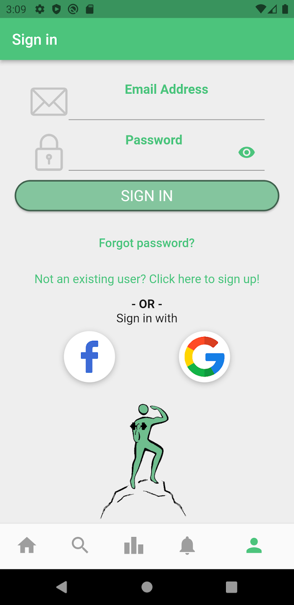
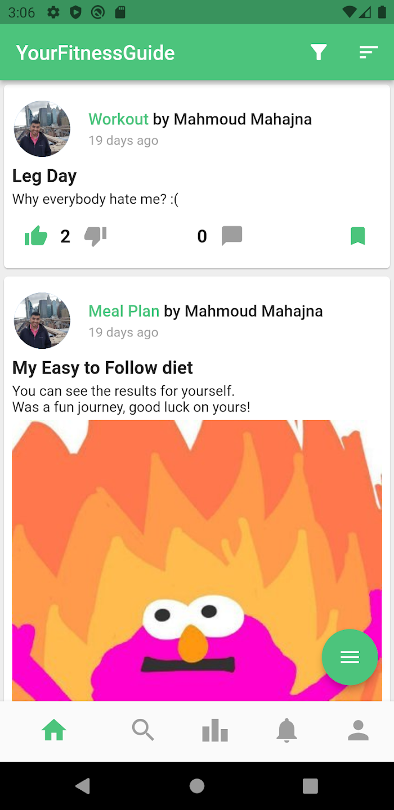

# YourFitnessGuide

> A social user-friendly app for get and share experiences in nutrition and working out. The application guides users to their fitness goals while interacting with other users. 

<a href='https://play.google.com/store/apps/details?id=com.technion.yourfitnessguide'>

    

## Motivation

* *Many people are trying to lose weight or follow a healthy lifestyle but do not really know where to start, what to focus on, and there are a lot of forums online that are filled with incoherent/potentially false info, which makes an already hard process harder. We aspire to create an app which tries to solve such problems and provide a smooth experience.*

## Core Features

* [ ] Share your workout routines or your meal plans.
* [ ] View other people's posts and interact with them.
* [ ] Follow other users.
* [ ] Filter posts by rating, date, followed users and others.
* [ ] Profile that provides full user experience.

## Complementary features

* [ ] Sign up and login with your email, Google or Facebook.
* [ ] Visit as a guest.
* [ ] Earn points by having your shared posts upvoted.
* [ ] Save posts and view them later.

## Table of Contents
1. [Application structure](docs/app_structure.md)
2. [Database](docs/database.md)
3. [Setup](docs/setup.md)
