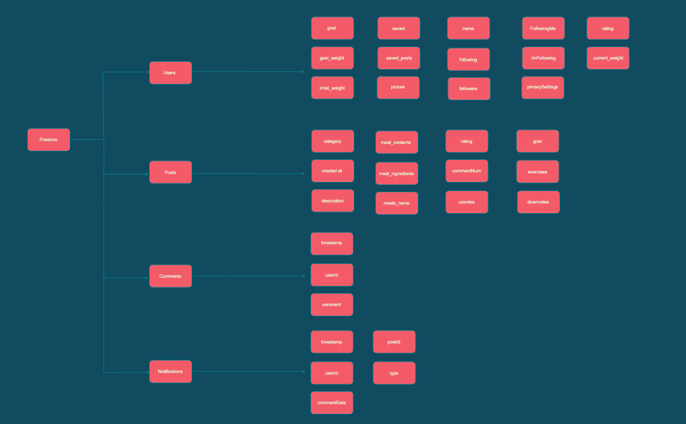

# Database

This doc explains the structure of our databases in Firebase
## Firestore
### versions
This is a collection of documents, each is related to different YourFitnessGuide version.
* v2: This is a document, which contains two collections:   
    *  users
    *  posts
    *  comments
    *  notifications
    

# users
- [ ] name
- [ ] picture
- [ ] rating
- [ ] current_weight
- [ ] initial_weight
- [ ] goal_weight
- [ ] saved
- [ ] saved_posts
- [ ] goal
- [ ] following
- [ ] folowers
- [ ] imFollowing
- [ ] followingMe
- [ ] privacySettings

# posts
- [ ] category
- [ ] createdAt
- [ ] description
- [ ] image_url
- [ ] rating
- [ ] title
- [ ] user_uid
- [ ] goals
- [ ] exercises
- [ ] meals_name
- [ ] meal_contents
- [ ] meal_ingredients
- [ ] commentsNum
- [ ] rating
- [ ] upvotes
- [ ] downvotes

# comments
- [ ] timestamp
- [ ] userId
- [ ] comment

# notifications
- [ ] timestamp
- [ ] userId
- [ ] commentData
- [ ] postId
- [ ] type

